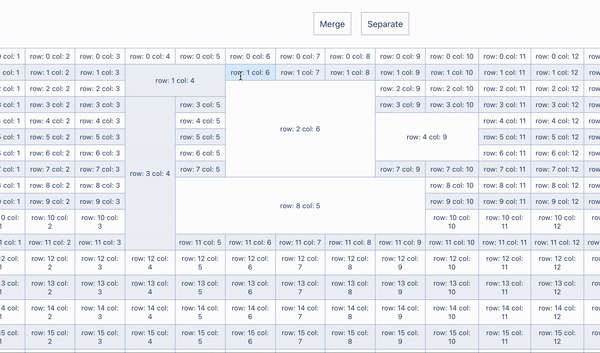
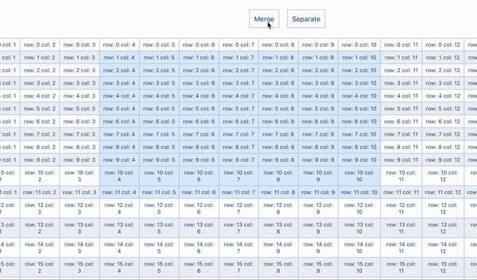

# Table with selection

Your task is to develop a table component with cells merge funtional

Please check our demo: https://mergetable.web.app/?width=10&height=15

## What is required
- Have to render table with size passed to query params
- Cells Have to be selected with mouse
- After selection cells can be merged or separated

### Requirements

- Table have to have size from `width` and `height` passed in query params
- Selection have to be handled by `mousedown`, `mousemove` and `mouseup` events
- Selection have to always select 'square' zone and stretch by merged cells
   
- After merge or separate cells selection have to stay on previous place:
  - After merge only new single cell selected
  - After separate cells all new cells in previous zone is selected
   
- Every cell have to have `colspan` and `rowspan` attributes (with value 1 or more)
- Every cell have to have data attributes
  - `data-col-index` - positive int.
     Merging or separating another cells in grid doesn't change index for current cell. 
     For example: if previous cell in row have index `0` and `colspan = 2` (cells with indexes `0` and `1` were merged), current cell have to have index `2`
  - `data-row-index` - positive int. As index for columns but for rows
  - `data-selected` - boolean
- Table have to be rendered by react components

## How your solution will be tested

Before send your solution run our e2e tests written in cypress.
To run tests type `npm run cy:run` in your terminal.
All tests should be succeeded.

> Tests simulate mouse selection by `mousedown` on first cell and `mousemove` and `mouseup` on last cells

> Buttons should have `data-separate-button` and `data-merge-button` attributes.

## Instructions

1. Clone this repo
2. Install modules `npm i`
3. Run project `npm start`
2. Write your code
3. Pass tests
4. Push your solution in your repo and send link back

### What allowed to do
- You can change any code under `src` folder
- You can change build process (project should be available on `localhost:3000` for tests)
- You can install or update any libraries except libraries for tables like `React tables`
- Change any styles

### What disallowed to do
- Change any code under `cypress` folder
- Change cypress version
- Change any scripts in `package.json`
- Amend or change any commits. You have to keep my initial commit.

✨ Good luck! ✨
